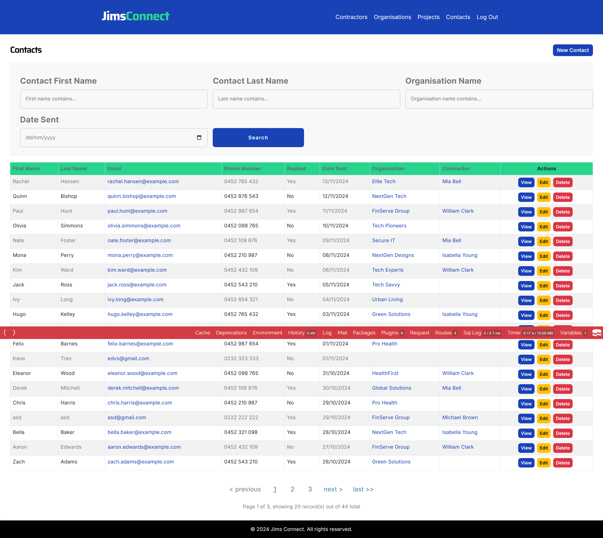
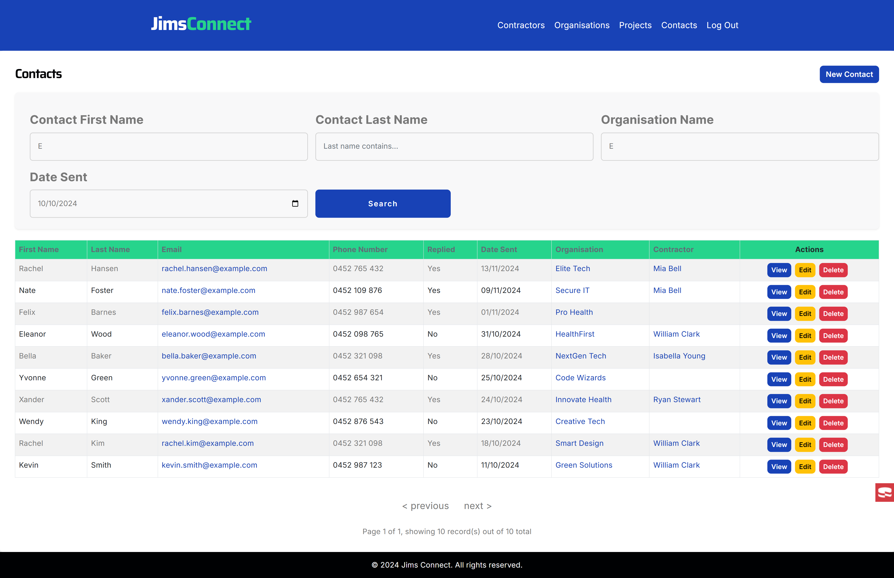
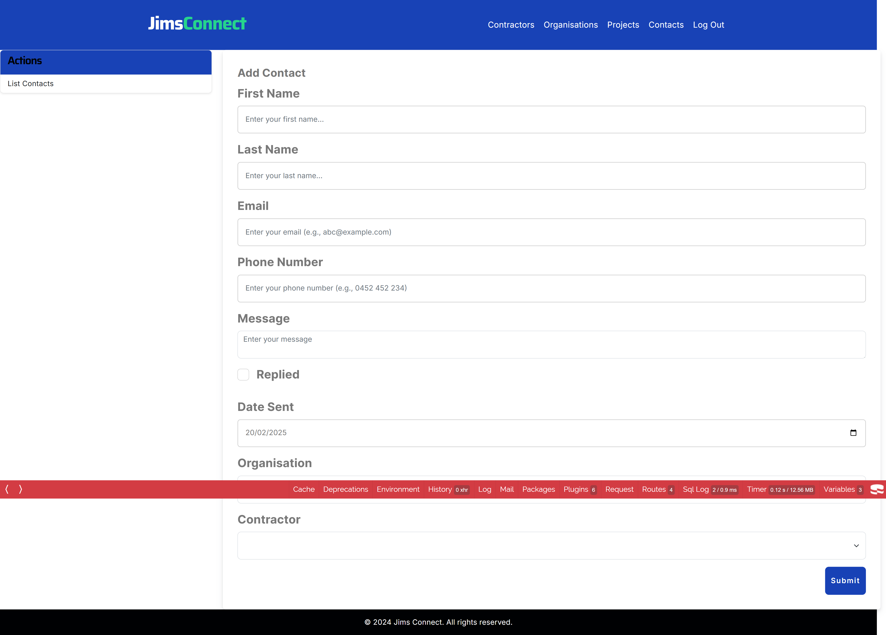
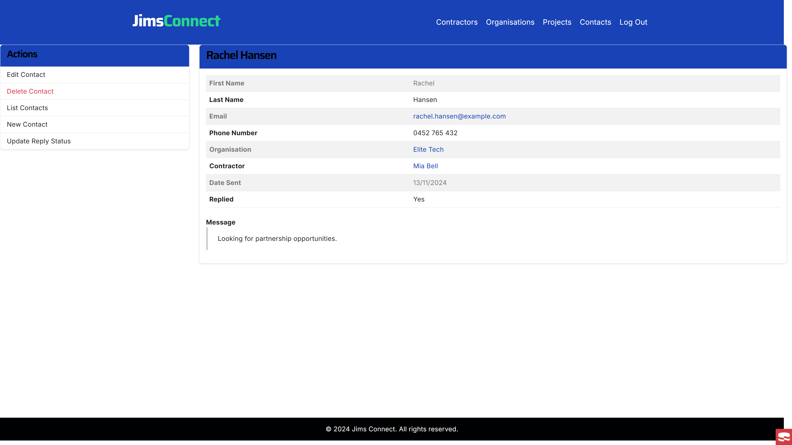
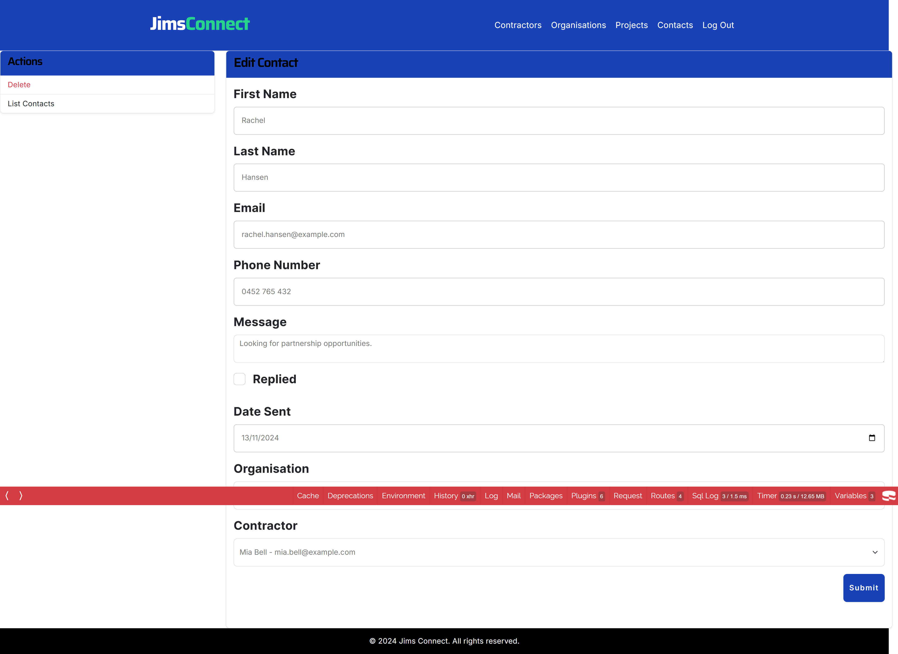
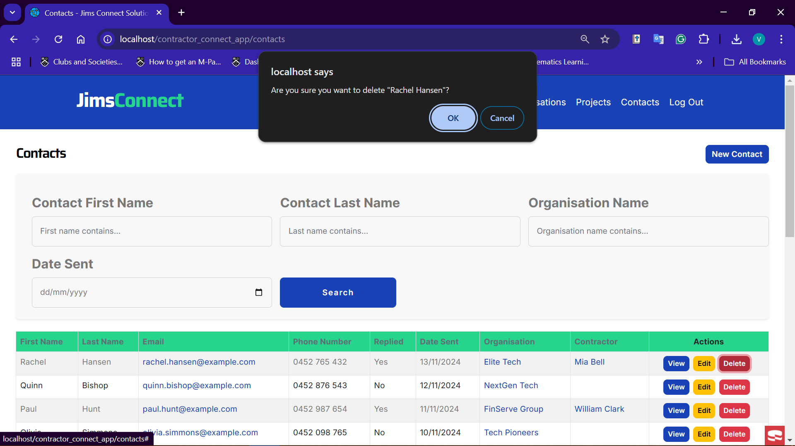
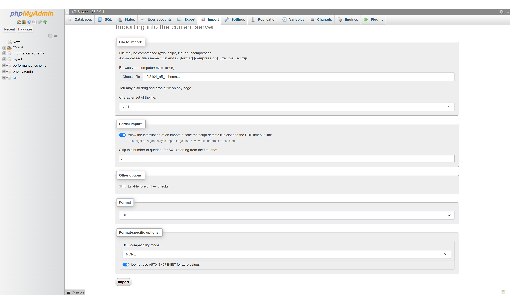

# Contractor Connect Application
A web application that enables organizations to outsource contractors for their projects

---

# Authors
- Viet Quoc Tran (33810672) - vtra0041@student.monash.edu
- Jiahuan He (31492185) - jhee0074@student.monash.edu
- Submission Date: 01/11/2024
---

# Repository
- Clone with HTTPS:
    ```bash
  https://github.com/Vincenzoos/contractor-connect-app.git
    ```
- Clone with SSH:
    ```bash
  git@github.com:Vincenzoos/contractor-connect-app.git
    ```
---

# Application Information and Credentials
_Note: this account is for demonstration purposes only._
- Business name: Jims Connect
- Business Owner: Nathan Jims
- email: nathan.recruiter@example.com
- password: L34fddFmvzxD

---

# Database Schema:
- [app schema](database/fit2104_a5_schema.sql)

---

# Entity Relationship Diagram (ERD)
- [Logical diagram](docs/erd/fit2104-a5-logical.png)

---

# Features:
- User Authentication & Management
  - ✅ Business staff can log in and access system functionalities.
  - ✅ Customers (organizations and contractors) can register as partners with Jims Connect.

- Project Management
  - ✅ CRUD operations: Create, Read, Update, Delete projects.
  - ✅ Update project details (name, progress, status, deadlines, etc.).
  - ✅ Link projects to contractors or organizations.

- Contractor & Organization Management
  - ✅ Manage contractor details (name, phone, profile picture, skills, etc.).
  - ✅ Manage organization details (name, contact info, industry, website, related projects, etc.).

- Contact Management
  - ✅ Handle new contractor and organization partnership requests.
  - ✅ Track and update contact statuses and details.


---

# Design Rationale
- [design_proposal](docs/rationale/design_proposal.pdf)
- [design_rationale](docs/rationale/design_rationale.pdf)

---

# Tech Stack
- **Frontend**: HTML, CSS, JavaScript, Bootstrap
- **Backend**: CakePHP
- **Database**: MySQL
- **Hosting**: XAMPP, phpMyAdmin

---

# Application Screenshots
## Landing pages
  - Homepage
  

  - About Us
    

  - Service
    

## Authentication
  - Staff Login
    

  - Contractor Registration
    

  - Organisation Registration
    

## Project Management
  - Project Listing
    

  - Project Filtering
    

  - Project Adding
    

  - Project Inspecting
    

  - Project Editing
    

  - Project Deleting
    

## Contractors Management
  - Contractor Listing
      

  - Contractor Filtering
    

  - Contractor Adding
    

  - Contractor Inspecting
    

  - Contractor Editing
    

  - Contractor Deleting
    

## Organisation Management
  - Organisation Listing
    

  - Organisation Filtering
    

  - Organisation Adding
    

  - Organisation Adding
    

  - Organisation Editing
    

  - Organisation Deleting
    

## Contacts Management
  - Contact listing
      

  - Contact Filtering
    

  - Contact Adding
    

  - Contact Inspecting
    

  - Contact Editing
    

  - Contact Deleting
    

---

# Application Installation
- ## Prerequisite:
  - 🔹 Install XAMPP
  - 🔹 Install PHPStorm
  - 🔹 Install CakePHP

- ## Installation Steps
  1. **Set Up XAMPP**
     - Run XAMPP as an administrator.
     - Start Apache and MySQL.

  2. **Create a user in phpMyAdmin**
      - Follow instruction here: https://youtu.be/6mOA53bR_B8?feature=shared

  3. **Database Configuration**
     - Create a new database with:
       - Database Name: username_databasename
       - Collation: utf8mb4_general_ci
     - Import the [app schema](database/fit2104_a5_schema.sql).
     - Ensure foreign key checks are disabled before importing.
     

  4. **Clone & Deploy the Application**
     - Clone the repository inside the htdocs folder.
     - Access the app via: http://localhost/your_folder_name

---

# External Code references:
- file upload:[CakePHP Upload Plugin](https://cakephp-upload.readthedocs.io/en/latest/configuration.html)
- authentication plugin: [CakePHP Authentication](https://book.cakephp.org/authentication/3/en/index.html)
- Kill session: [How to Destroy a Session](https://book.cakephp.org/1.3/en/The-Manual/Core-Components/Sessions.html#destroy)

