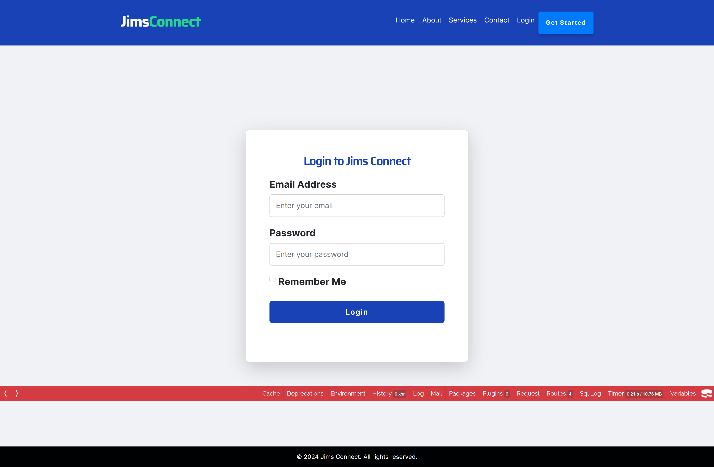

# Contractor Connect Application
An App to allow organization to outsource contractors for their projects

# TODO:
- Add UI prototype and presentation to show the rationale behind the design
- Add a description of the app, its features, tech stack used, etc.
- Add real images of the app to showcase its functionalities

# Authors:
- Viet Quoc Tran (33810672) - email:vtra0041@student.monash.edu - submission date: 1/11/2024
- Jiahuan He (31492185) - email: - jhee0074@student.monash.edu submission date: 1/11/2024

# Repo:
- Clone with HTTPS: https://github.com/Vincenzoos/contractor-connect-app.git
- Clone with SSH: git@github.com:Vincenzoos/contractor-connect-app.git

# Application Credentials:
- Business Owner: Nathan Jims
- email: nathan.recruiter@example.com
- password: L34fddFmvzxD

# Schema:
- [fit2104_a5_schema.sql](database/fit2104_a5_schema.sql)

# ER Diagram
- [logical_diagram](docs/erd/fit2104-a5-logical.png)

# Features:
- Allows business staff to log in and use the system
- Allows customers (organisations and contractors) to become a partner with Jims Connect
- Allows staff to manage projects in the system (i.e. CRUD, update project info such as name progress status, check date, link project to different contractor or organisation)
- Allows staff to manage contractors in the system (i.e. CRUD, update personal info such as name, phone number, profile pic, skills)
- Allows staff to manage organisations in the system (i.e. CRUD, update info such as name, contact phone number, projects related, industry, website)
- Allows staff to manage contacts, new contractors, organisations who want to become partner with Jims Connect (i.e. CRUD, update replied status, contact details, etc)

# Rationale
- [design_proposal](docs/rationale/design_proposal.pdf)
- [design_rationale](docs/rationale/design_rationale.pdf)
# App Demonstration Screenshots
- Landing pages
  - Homepage
  

  - About Us
    

  - Service
    

- Business staff and business customer Authentication
  - Staff Authentication
    

  - Contractor Registration
    

  - Organisation Registration
    

- Manages Projects
  - Project listing
    

  - Filter Project
    

  - Create new Project
    

  - Read Project
    

  - Edit Project
    

  - Delete Project
    

- Manges Contractors
  - Contractor listing
      

  - Filter Contractor
    

  - Create new Contractor
    

  - Read Contractor
    

  - Edit Contractor
    

  - Delete Contractor
    

- Manages Organisation
  - Organisation listing
    

  - Filter Organisation
    

  - Create new Organisation
    

  - Read Organisation
    

  - Edit Organisation
    

  - Delete Organisation
    

- Manages Contacts

# External Code references:
- file upload: https://cakephp-upload.readthedocs.io/en/latest/configuration.html
- authentication plugin: https://book.cakephp.org/authentication/3/en/index.html
- Kill session: https://book.cakephp.org/1.3/en/The-Manual/Core-Components/Sessions.html#destroy

